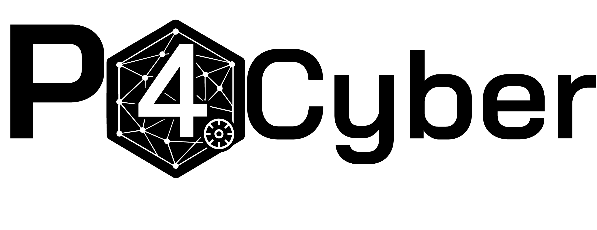

  <picture>
    <source media="(prefers-color-scheme: dark)" srcset="media/P4Cyber_W.png">
    <source media="(prefers-color-scheme: light)" srcset="media/P4Cyber.png">
   
  </picture>

# **P4Cyber** - **Peers for Cyber**

**Unstoppable · Decentralized · Neutral** 

*CYBER INTELLIGENCE*

A decentralized, verifiable, and unstoppable layer for Internet-wide cyber intelligence 

**built on [Pears](https://docs.pears.com/) by [Holepunch](https://holepunch.to/)**.

---

## **Why This Matters**

The Internet’s public surface is the world’s largest shared digital infrastructure — yet today, visibility into it is mediated by a few centralized entities. These systems, while powerful, introduce single points of failure, policy bias, and fragility. **P4Cyber changes that.**

* **World-first decentralized cyber intelligence:** no central index, no choke points, no gatekeepers.
* **Neutral and ownerless:** no company or nation decides what gets scanned, stored, or queried.
* **Verifiable by design:** append-only logs, signed feeds, reproducible scans.
* **Fresher coverage at global scale:** a swarm of peers outpaces any single data center — more ports, more IPs, more often.

---

## **The Idea in 90 Seconds**

Today’s exposure search engines — like Shodan, Shadowserver, and Censys — are centralized: one operator scans, stores, and serves. That brings power, but also fragility: single policy surface, cost ceilings, limited reach, uneven freshness, and stoppability.

**P4Cyber flips the model.** Anyone can run a node. Nodes collaborate to schedule work, perform scans, sign results, and replicate data across a peer-to-peer fabric. Think *“BitTorrent for cyber exposure”* with built-in guarantees on integrity, provenance, and safety.

**Vision:** a neutral, censorship-resistant, ownerless cyber intelligence layer for the public Internet — *port-wide by default*, with broader IP coverage and higher refresh cadence than any solitary system can sustain.

---

## **Core Principles**

* **Decentralization:** scanning, indexing, and serving via a mesh of peers — no central servers.
* **Neutrality:** an ownerless protocol and signed feeds ensure no single entity controls inclusion or access.
* **Unstoppable:** discovery and replication happen over the swarm; data lives everywhere and nowhere.
* **Verifiability:** append-only logs, cryptographic signatures, and reproducible parameters guarantee trust in proofs, not authorities.

---

## **Philosophy**

Centralized security intelligence is powerful but fragile. P4Cyber rethinks how truth about the Internet is measured and shared. Only a decentralized and verifiable architecture can guarantee reliability and neutrality.

In cybersecurity, truth must not depend on a single operator’s database or a single jurisdiction’s policy. P4Cyber treats Internet measurement as shared infrastructure — governed by protocols and proofs, not by corporate policies or government directives.

* **Decentralized by design →** no single company or state can become a gatekeeper or point of failure for who sees what, or when.
* **Cryptographically verifiable →** results are reproducible and tamper-evident; trust is placed in math and code, not institutions.
* **Neutral and ownerless →** inclusion and behavior are determined by transparent rules that no party can unilaterally bend.

This philosophy ensures that access, distribution, and policy cannot be captured by any one actor. Decisions about how data is shared are transparent and collectively defined, while the protocol guarantees that no single authority can deny, distort, or selectively grant access to a fundamental resource: security.

---

## **Challenges**

P4Cyber is intentionally ambitious: a fully decentralized, neutral, and unstoppable network that continuously maps the Internet’s attack surface and, over time, expands into a broader Cyber Intelligence commons. That scope — global coverage, constant freshness, and trust-by-design without a central operator — poses several challenges:

1. **Internet-scale coverage:** approaching *“all ports over all IPv4”* with meaningful recency (and preparing for IPv6’s vastness), while managing duplication, bias, and ethical rate limits.
2. **Heterogeneous node environments:** running the P4Cyber node reliably across diverse OSes and form factors (server, desktop, mobile) and network conditions, while preserving consistent measurement semantics and reproducibility — without central orchestration. This demands scalable coordination, adaptive load balancing, and resilience across devices.
3. **Incentivizing participation:** designing fair, manipulation-resistant rewards so nodes contribute bandwidth, compute, and storage sustainably, while resisting Sybil attacks and low-quality data.
4. **Jurisdictional resilience:** operating reliably across countries with varying laws and censorship, embedding practical tools that help node operators handle blocks, throttling, and legal constraints — while preserving simplicity and neutrality.

---

## **Future Development**

P4Cyber is currently in an **alpha phase** focused on validating the core idea and stress-testing Internet-scale execution. We are experimenting with **[Pears](https://docs.pears.com/)** as the decentralization layer, evaluating distributed scanning algorithms, and optimizing data structures for peer-driven repositories.

This phase informs the **beta stage**, where the project will operate in production-like conditions with defined objectives — coverage targets, freshness SLAs, proof-of-measurement guarantees, and improved node onboarding UX.

As development progresses, P4Cyber will introduce **operator incentives**, potentially through a **token model** tied to verifiable contributions (bandwidth, compute, storage). These incentives will follow transparent, manipulation-resistant rules that reward active, high-quality participation.

Looking ahead, P4Cyber will integrate **decentralized AI agents** to autonomously perform advanced Cyber Intelligence tasks — such as correlating exposed services, anomaly detection, and trend analysis across peer-generated data. These agents will operate transparently using local compute and federated coordination to preserve privacy, neutrality, and resilience while enhancing collective situational awareness.

In parallel, the platform will evolve beyond surface scanning toward a complete Cyber Intelligence ecosystem — a community-driven resource for neutral-by-design cybersecurity. 

Optionally, as part of this roadmap, we may provide **decentralized VPN tooling** to bolster jurisdictional resilience — a capability relevant not only to P4Cyber’s operations but also to broader efforts that safeguard neutrality and freedom of expression online.

